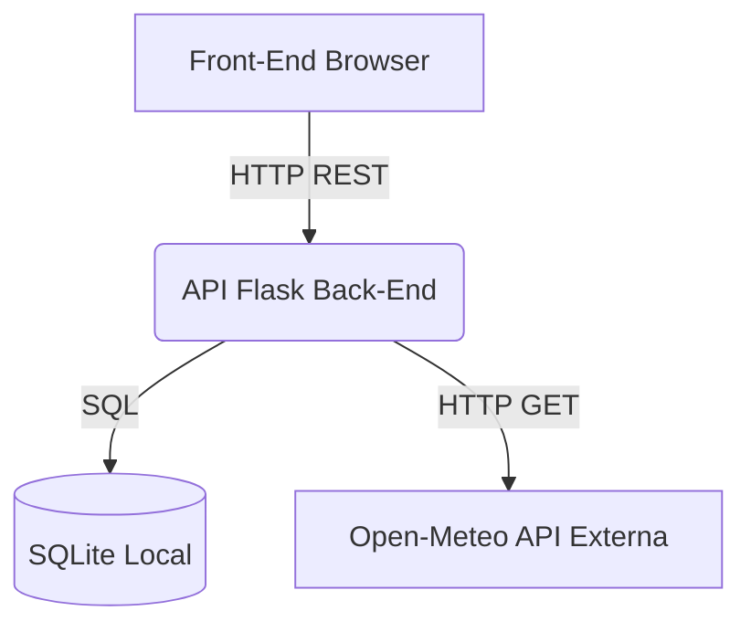

# MVP - Gestão de Hotel (API Back-End)

Este é o módulo Back-End do MVP da sprint de Arquitetura de Software da PUC-RJ. O sistema expõe uma API RESTful para gestão de quartos de hotel.

## Funcionalidades e API Externa

A API gerencia o cadastro de quartos (CRUD) utilizando o banco de dados SQLite e consome uma API externa pública:
- **API Externa:** [Open-Meteo](https://open-meteo.com/)
- **Descrição:** O Open-Meteo é um serviço gratuito de previsão do tempo que não requer chave de autenticação (API Key). A nossa API (Back-End) consome este serviço na rota `/weather` para disponibilizar ao front-end as informações climáticas atuais do local do hotel (configurado internamente para o Rio de Janeiro).
- **Sem redirecionamento:** O consumo desta API é feito transparentemente pelo servidor via requisição HTTP, tratando os dados internamente e devolvendo o JSON final, sem redirecionar o cliente (Front-End).

## Tecnologias Utilizadas

- **Python 3.9+**
- **Flask** (Framework web)
- **Flask-SQLAlchemy** (ORM para SQLite)
- **Flasgger** (Documentação interativa Swagger)
- **Docker** (Containerização)

## Como executar localmente sem Docker

1. Crie e ative um ambiente virtual:
   ```bash
   python -m venv venv
   source venv/bin/activate  # No Windows: venv\Scripts\activate
   ```
2. Instale as dependências:
   ```bash
   pip install -r requirements.txt
   ```
3. Execute a API:
   ```bash
   flask run --host=0.0.0.0 --port=5000
   ```

## Como executar com Docker

1. Construa a imagem:
   ```bash
   docker build -t mvp-hotel-api .
   ```
2. Rode o container:
   ```bash
   docker run -p 5000:5000 mvp-hotel-api
   ```

## Acessando a Documentação (Swagger)

Com a API rodando, acesse a documentação interativa das rotas no navegador:
**[http://localhost:5000/apidocs/](http://localhost:5000/apidocs/)**

## Arquitetura

O sistema segue o modelo cliente-servidor padrão com a Interface (Front-End) comunicando-se com esta API via chamadas HTTP (Fetch API). A API por sua vez comunica-se com a API Externa Open-Meteo para a previsão do tempo.


